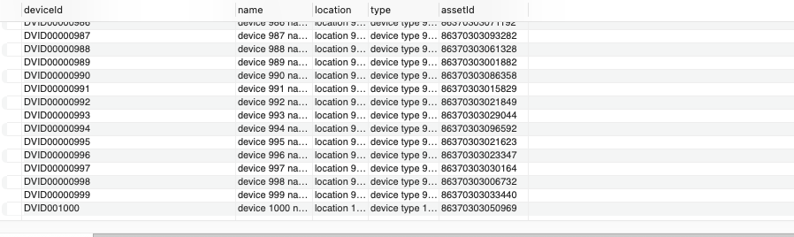
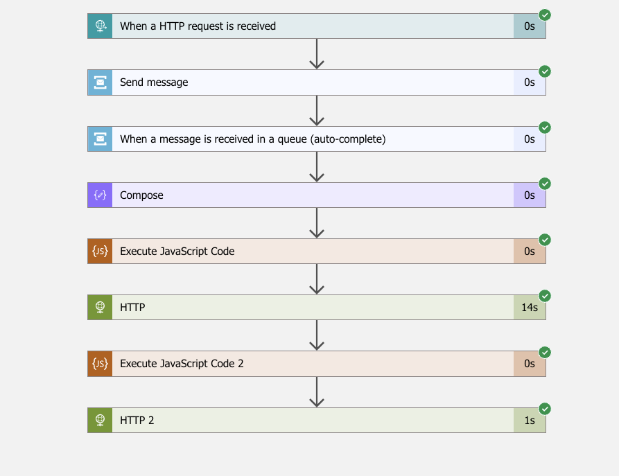
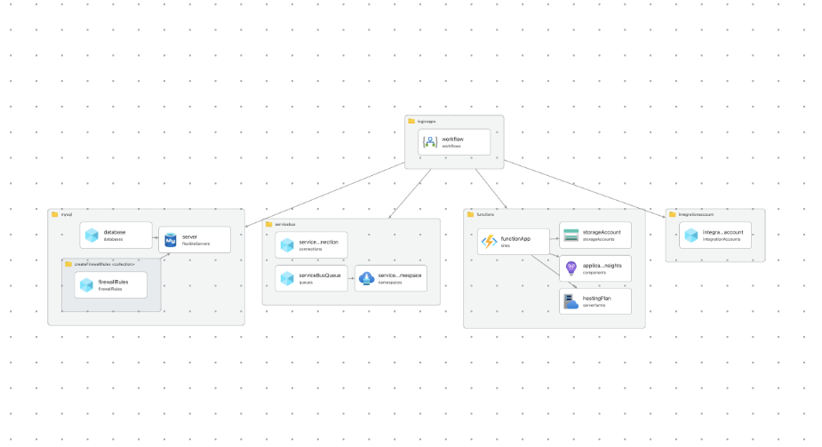

### Deliverables
- Register new data in database  
Image of from workbench. For full data, refer to [result](out.csv).
  


- Registering 1000 data < 10 mins. 14s
  


### Infrastructure Deployed


### Prerequisites
- Resources such as resource group have to be deployed in the subscription scope

```bash
az deployment group create \
  --name test-deployment \
  --resource-group rg-vnext-device-prod \
  --template-file infrastructure/main.bicep 
```

- Table Creation
```sql
CREATE TABLE device (
    deviceId varchar(255),
    name varchar(255),
    location varchar(255),
    type varchar(255),
    assetId varchar(255)
);
```
